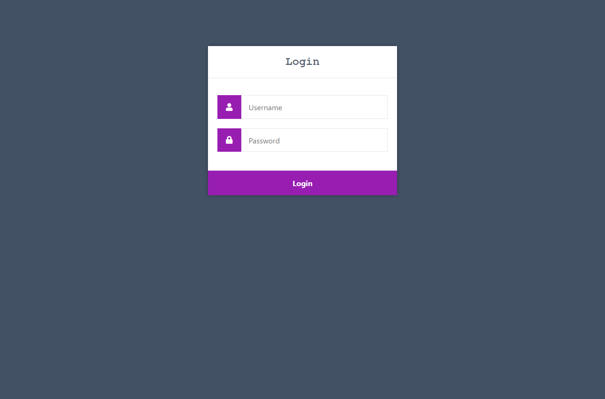

# login app express mysql
simple page for user login with mysql databases

## Start application

* First step

Download the project with git clone `https://github.com/hennyfeliz/login-app-express-mysql`

Don't forget to create the database and the table with the user data (you can add more)...
You should also change the mysql configuration values ​​in `login.js`

You must run this command to download the necessary dependencies `npm install`

...and finally to run the project you must install a development dependency called "nodemon" with the command `npm install nodemon -D` and run the project with `npm run start`.

[]
